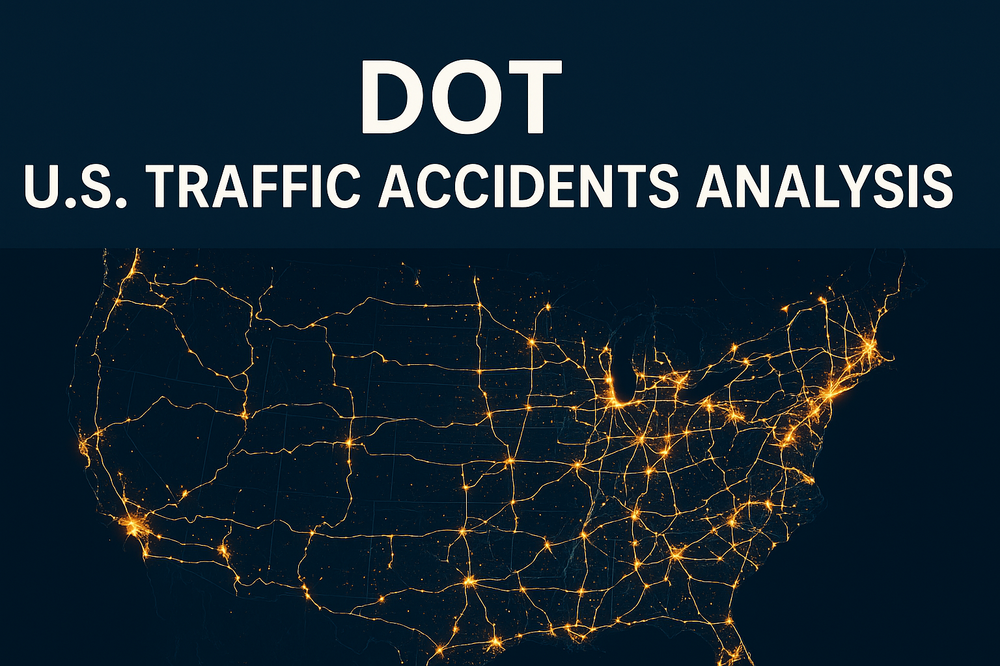
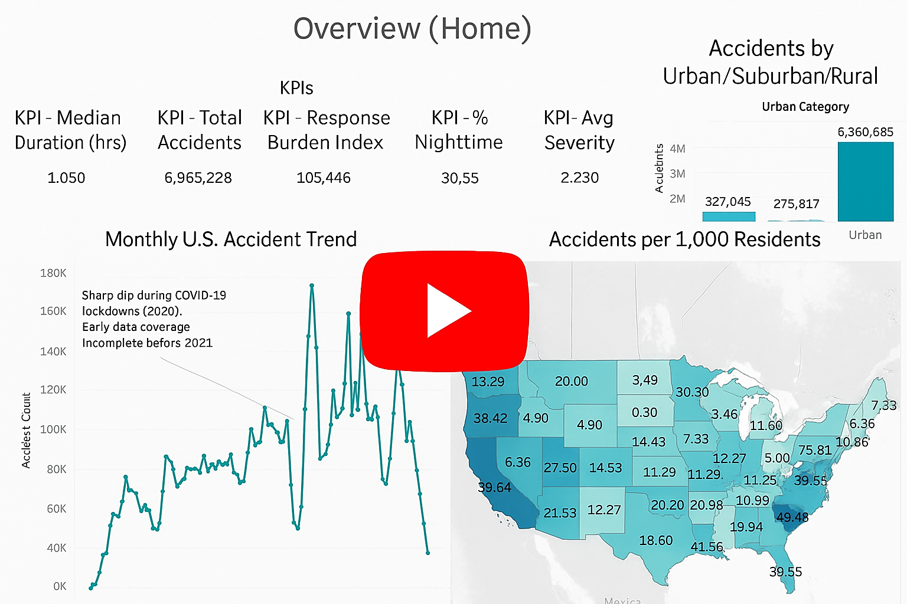

  

---

# Traffic Analysis Findings

  
   
  <em>Watch: 10‑min walkthrough of the Traffic Analysis Findings</em>

---

**Your written reflection (suggested length of 200-400 words) should address:**

1. **Accomplishments:**
  * What aspects of the project were most successful?
  * Which techniques or approaches yielded the most valuable insights?
  * What did you learn about working with real-world data?
  * Which aspect of the project are you most proud about?

2. **Opportunity for Growth:**
  * What challenges did you face during the project?
  * How did you overcome them?
  * What would you do differently next time?
  * What technical or analytical skills do you need to develop further?

3. **2Future Improvements:**
  * How would you extend or improve this analysis if you had more time, data, or resources?
  * What additional questions would you explore?
  * How might you enhance your dashboard or recommendations to provide even more value?
  * If you could request additional data (new information) what would you think would be beneficial to explore? 
